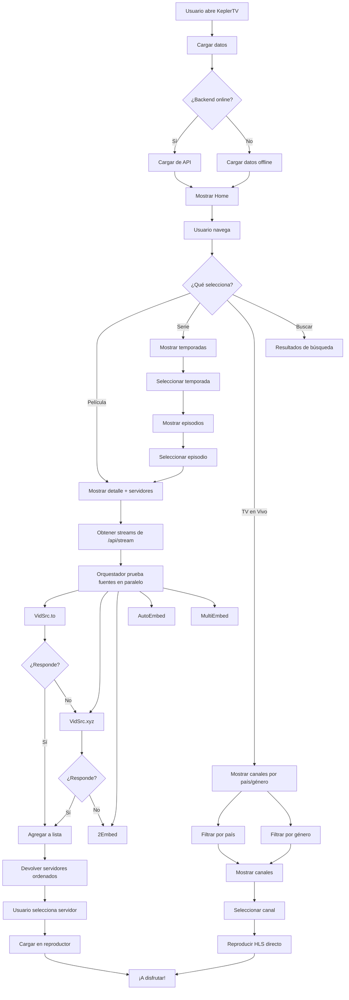

# KeplerTV — Plan de Arquitectura y Estrategia de APIs

## 📋 Resumen del Problema

Actualmente KeplerTV usa:
- **TMDB API** → Metadata de películas/series (títulos, posters, sinopsis) ✅ Bueno
- **vidsrc.to / vidsrc.xyz / 2embed / autoembed** → Enlaces de video embed ❌ Poco confiables
- **IPTV-org** → Canales de TV en vivo ✅ Bueno pero limitado

**El problema principal:** No hay una API única que dé enlaces de video directos y funcionales para contenido en español. Las soluciones actuales (vidsrc, etc.) son frágiles, tienen anuncios, y se caen frecuentemente.

---

## 🎯 Visión: App tipo MagisTV / Cuevana para habla hispana

```
┌─────────────────────────────────────────────────────────────┐
│                    KEPLERTV 2.0                             │
├─────────────────────────────────────────────────────────────┤
│  🎬 Películas     📺 Series (con eps)   📡 TV en Vivo      │
│                                                             │
│  🌎 TODO EN ESPAÑOL / LATINO                                │
│                                                             │
│  Fuentes de Video:                                           │
│  ├─ Múltiples embed servers con fallback automático         │
│  ├─ Scraping propio (Cuevana3, TheFlix, etc.)              │
│  └─ IPTV-org + canales fijos verificados (TV en vivo)      │
│                                                             │
│  Metadata: TMDB API en español (es-ES)                      │
│  Búsqueda: TMDB + scraping combinado                        │
└─────────────────────────────────────────────────────────────┘
```

---

## 🏗️ Arquitectura Propuesta

### Capa 1: Metadata API (TMDB — ya funciona en español)
```
backend/server.js
├── /api/movies/popular          → TMDB (es-ES, region ES)
├── /api/movies/now-playing      → TMDB (es-ES)
├── /api/movies/trending         → TMDB (es-ES)
├── /api/movies/top-rated        → TMDB (es-ES)
├── /api/movies/:id              → TMDB detalles (es-ES)
├── /api/series/popular          → TMDB (es-ES)
├── /api/series/trending         → TMDB (es-ES)
├── /api/series/top-rated        → TMDB (es-ES)
├── /api/series/:id              → TMDB detalles (es-ES)
├── /api/series/:id/season/:num  → TMDB temporada/episodios (es-ES)
├── /api/discover/genre/:id      → TMDB por género (es-ES)
├── /api/discover/provider/:id   → TMDB por proveedor (es-ES)
└── /api/search                  → TMDB búsqueda multi (es-ES)
```

### Capa 2: Stream Sources Engine (NUEVO — Corazón del sistema)
```
backend/
├── sources/
│   ├── index.js                 → Orquestador con fallback automático
│   ├── vidsrc.js                → vidsrc.to / .xyz / .cc / .nl
│   ├── embed2.js                → 2embed.cc / 2embed.to
│   ├── autoembed.js             → autoembed.cc
│   ├── multiembed.js            → multiembed.mov
│   └── scraper.js               → Scraper genérico (Cuevana3, TheFlix)
├── services/
│   └── stream-resolver.js       → Endpoint unificado /api/stream/...
└── utils/
    └── stream-cache.js          → Cache de enlaces (TTL 1h)
```

### Capa 3: TV en Vivo (MEJORAR — Canales funcionales por país/tipo)
```
backend/
├── services/
│   └── iptv.js                  → IPTV-org + canales fijos verificados
├── data/
│   ├── reliable-channels.js     → Canales fijos que SÍ funcionan
│   ├── sports-channels.js       → Canales de deportes verificados
│   └── countries.js             → Organización por país
└── routes/
    └── tv.js                    → /api/tv/live-channels con filtros
```

---

## 🔌 Estrategia de Fuentes de Video

### Sistema de Fallback Automático

Cuando un usuario quiere ver una película/serie:

```
1. Llamar a /api/stream/movie/{id}
2. El orquestador prueba TODAS las fuentes en paralelo
3. Cada fuente devuelve { server, url, quality, lang }
4. Se filtran solo las que responden (timeout 5s por fuente)
5. Se ordenan por calidad (FHD > HD > SD)
6. Se devuelve el array al frontend
7. Si la primera falla, el usuario puede probar la siguiente
```

### Fuentes Incluidas

| Fuente | URL Base | Audio Español | Calidad | Prioridad |
|--------|----------|---------------|---------|-----------|
| **VidSrc.to** | `https://vidsrc.to/embed/movie/{id}` | ✅ Selector audio | FHD | 1 |
| **VidSrc.xyz** | `https://vidsrc.xyz/embed/movie/{id}` | ✅ Castellano | FHD | 2 |
| **2Embed** | `https://www.2embed.cc/embed/{id}` | ✅ Sí | FHD | 3 |
| **VidSrc.cc** | `https://vidsrc.cc/vidsrc/movie/{id}` | ✅ Sí | HD | 4 |
| **AutoEmbed** | `https://player.autoembed.cc/embed/movie/{id}` | ✅ Sí | HD | 5 |
| **VidSrc.nl** | `https://player.vidsrc.nl/embed/movie/{id}` | ✅ Sí | FHD | 6 |
| **MultiEmbed** | `https://multiembed.mov/directstream.php?video_id={id}` | ✅ Sí | HD | 7 |

**Para series:** `https://vidsrc.to/embed/tv/{id}/{season}/{episode}`

---

## 📺 TV en Vivo — Organización por País y Tipo

### Canales Fijos Verificados (Funcionan)

#### España
| Canal | Género | Streaming |
|-------|--------|-----------|
| La 1 (RTVE) | Entretenimiento | ✅ HLS directo |
| La 2 (RTVE) | Documentales | ✅ HLS directo |
| 24 Horas (RTVE) | Noticias | ✅ HLS directo |
| Clan TV (RTVE) | Infantil | ✅ HLS directo |
| Teledeporte (RTVE) | Deportes | ✅ HLS directo |

#### Argentina
| Canal | Género | Streaming |
|-------|--------|-----------|
| Canal 26 | Noticias | ✅ HLS directo |
| El Trece | Entretenimiento | ✅ HLS directo |
| Telefe | Entretenimiento | ✅ HLS directo |
| TV Pública | Generalista | ✅ HLS directo |
| América TV | Entretenimiento | ✅ HLS directo |
| Canal 9 | Entretenimiento | ✅ HLS directo |

#### México
| Canal | Género | Streaming |
|-------|--------|-----------|
| Milenio TV | Noticias | ✅ HLS directo |

#### Internacional
| Canal | Género | Streaming |
|-------|--------|-----------|
| France 24 Español | Noticias | ✅ HLS directo |
| DW Español | Noticias | ✅ HLS directo |
| RT en Español | Noticias | ✅ HLS directo |
| Al Jazeera English | Noticias | ✅ HLS directo |
| CGTN Español | Noticias | ✅ HLS directo |
| Red Bull TV | Deportes | ✅ HLS directo |
| NASA TV | Documentales | ✅ HLS directo |
| KBS World | Entretenimiento | ✅ HLS directo |
| Fashion TV | Entretenimiento | ✅ HLS directo |
| Clubbing TV | Música | ✅ HLS directo |

### Canales IPTV-org (Dinámicos, se actualizan solos)
Se cargan desde `https://iptv-org.github.io/iptv/languages/spa.m3u`
→ Filtrados por idioma español
→ Merge con canales fijos (sin duplicados)
→ Categorizados por género y país

---

## 📦 Estructura de Archivos Final

```
keplertv/
├── backend/
│   ├── server.js                    ← Entry point + middleware
│   ├── package.json
│   ├── .env
│   ├── routes/
│   │   ├── movies.js                ← Rutas de películas
│   │   ├── series.js                ← Rutas de series
│   │   ├── tv.js                    ← Rutas de TV en vivo
│   │   ├── search.js                ← Búsqueda
│   │   └── stream.js                ← Endpoints de streams
│   ├── services/
│   │   ├── tmdb.js                  ← Cliente TMDB
│   │   ├── iptv.js                  ← Cliente IPTV-org
│   │   └── stream-resolver.js       ← Resolvedor de streams
│   ├── sources/
│   │   ├── index.js                 ← Orquestador con fallback
│   │   ├── vidsrc.js                ← Fuente VidSrc
│   │   ├── embed2.js                ← Fuente 2Embed
│   │   ├── autoembed.js             ← Fuente AutoEmbed
│   │   ├── multiembed.js            ← Fuente MultiEmbed
│   │   └── scraper.js               ← Scraper genérico
│   ├── utils/
│   │   ├── cache.js                 ← Sistema de caché
│   │   ├── genres.js                ← Mapas de géneros
│   │   └── helpers.js               ← Utilidades
│   └── data/
│       ├── reliable-channels.js     ← Canales fijos verificados
│       └── sports-channels.js       ← Canales de deportes extra
│
├── App.js                           ← UI principal React Native (web)
├── index.html                       ← UI web vanilla
├── components/
│   └── Cards.js                     ← Componentes compartidos
├── services/
│   └── api.js                       ← Cliente API frontend
├── mobile/
│   ├── App.js                       ← App móvil
│   ├── services/
│   │   └── api.js                   ← Cliente API móvil
│   └── components/
│       └── Cards.js                 ← Componentes móvil
└── plans/
    └── API_STRATEGY_AND_ARCHITECTURE.md
```

---

## 🛠️ Plan de Implementación por Fases

### FASE 1: Refactor del Backend (Modularización)
**Objetivo:** Organizar el backend en módulos mantenibles sin romper nada

**Tareas:**
1. Crear estructura de directorios (`routes/`, `services/`, `sources/`, `utils/`, `data/`)
2. Extraer mapas de traducción a `utils/genres.js`
3. Crear `services/tmdb.js` con todas las llamadas a TMDB
4. Crear `services/iptv.js` con la lógica de IPTV-org + canales fijos
5. Extraer canales fijos a `data/reliable-channels.js`
6. Crear rutas separadas en `routes/movies.js`, `routes/series.js`, `routes/tv.js`, `routes/search.js`
7. Refactorizar `server.js` para que solo sea entry point
8. **Probar que todo funciona exactamente igual que antes**

### FASE 2: Sistema de Stream Sources (NUEVO)
**Objetivo:** Crear orquestador que intente múltiples servidores y devuelva los que funcionan

**Tareas:**
1. Crear `sources/index.js` (orquestador con timeout y fallback)
2. Implementar `sources/vidsrc.js` (VidSrc.to, .xyz, .cc, .nl)
3. Implementar `sources/embed2.js` (2Embed)
4. Implementar `sources/autoembed.js` (AutoEmbed)
5. Implementar `sources/multiembed.js` (MultiEmbed)
6. Crear `services/stream-resolver.js` (endpoint unificado)
7. Implementar `utils/cache.js` para cachear enlaces (TTL: 1 hora)
8. Crear `routes/stream.js` con endpoints:
   - `GET /api/stream/movie/:id` → Array de servidores
   - `GET /api/stream/tv/:id/:season/:episode` → Array de servidores
9. **Probar con curl que devuelve servidores**

### FASE 3: Series con Temporadas y Episodios
**Objetivo:** Navegación completa de series con selector de temp/ep

**Tareas:**
1. Asegurar endpoint `/api/series/:id` devuelve número de temporadas
2. Crear endpoint `/api/series/:id/seasons` (lista de temporadas con nombres)
3. Mejorar endpoint `/api/series/:id/season/:seasonNumber` (ya existe)
4. Actualizar UI en `index.html`:
   - Al hacer clic en serie → mostrar selector de temporada
   - Al seleccionar temporada → mostrar lista de episodios
   - Al seleccionar episodio → mostrar servidores de stream
5. Actualizar `App.js` (React Native) con misma lógica
6. Integrar stream resolver en reproducción de episodios

### FASE 4: Mejora de UI/UX (Estilo MagisTV/Cuevana)
**Objetivo:** Interfaz más pulida y funcional

**Tareas:**
1. Mejorar `index.html`:
   - Diseño responsive más limpio
   - Selector de servidores con indicador visual de funcionando
   - Selector de temporada/episodio para series
   - Mejor organización de TV por país y género
   - Indicador "EN VIVO" para canales
2. Mejorar `App.js` (React Native web):
   - Sincronizar con mejoras de index.html
   - Navegación fluida entre vistas
3. Añadir `utils/cache.js` para datos offline
4. Mejorar experiencia de búsqueda con resultados en tiempo real

### FASE 5: Web Scraping Avanzado (Opcional — Para más fuentes)
**Objetivo:** Fuentes de video propias mediante scraping

**Tareas:**
1. Investigar sitios objetivo (Cuevana3, TheFlix, etc.)
2. Implementar `sources/scraper.js` con Cheerio + Axios
3. Rotación de User-Agent
4. Cachear resultados para evitar bans
5. Integrar con el orquestador de fuentes

---

## 🔄 Diagrama de Flujo Completo



---

## 📊 Estado Actual vs. Futuro

| Característica | Estado Actual | Estado Futuro |
|---------------|---------------|---------------|
| Películas | ✅ TMDB + vidsrc.to | ✅ TMDB + 7 servidores con fallback |
| Series | ⚠️ Solo populares, sin episodios | ✅ Con temporadas y episodios |
| TV en Vivo | ✅ IPTV-org + canales fijos | ✅ Mejor organizado por país/género |
| Canales Deportes | ⚠️ Solo Red Bull TV | ✅ Teledeporte + Red Bull + IPTV sports |
| Audio Español | ✅ TMDB en es-ES | ✅ Múltiples servidores con audio ES |
| Servidores Video | ❌ Solo vidsrc.to hardcodeado | ✅ 7 servidores con fallback automático |
| Caché | ❌ No hay | ✅ Caché de streams y metadata |
| UI/UX | ⚠️ Funcional pero mejorable | ✅ Estilo MagisTV/Cuevana pulido |
| Modo Offline | ❌ No hay | ✅ Datos cacheados para offline |

---

## 🚀 Orden de Implementación Recomendado

```
Semana 1: FASE 1 (Refactor) + FASE 2 (Stream Sources)
  → Resultado: Backend modular + 7 servidores de video con fallback

Semana 2: FASE 3 (Series con episodios)
  → Resultado: Series navegables con temporadas y episodios

Semana 3: FASE 4 (UI/UX)
  → Resultado: Interfaz tipo MagisTV/Cuevana pulida

Semana 4+: FASE 5 (Scraping avanzado)
  → Resultado: Fuentes de video propias
```

---

## 📝 Notas Técnicas

1. **TMDB API Key** ya configurada en `backend/.env` ✅
2. **IPTV-org** ya integrado y funcionando ✅
3. **Stream proxy** (`/api/stream-proxy`) ya existe para evitar CORS ✅
4. **Cheerio** ya instalado en backend para scraping ✅
5. **Expo** para web y móvil ✅
6. **No cambiar de framework** — React Native + Express es suficiente

---

## 🧪 Pruebas Rápidas

```bash
# Fase 1: Refactor (debe funcionar igual)
cd backend && npm start
curl http://localhost:3000/api/movies/popular

# Fase 2: Stream Sources
curl http://localhost:3000/api/stream/movie/693134
# → Array de servidores disponibles

# Fase 3: Series
curl http://localhost:3000/api/series/1396/season/1
# → Episodios de Breaking Bad S01

# Fase 4: UI
Abrir http://localhost:3000 en el navegador
```
