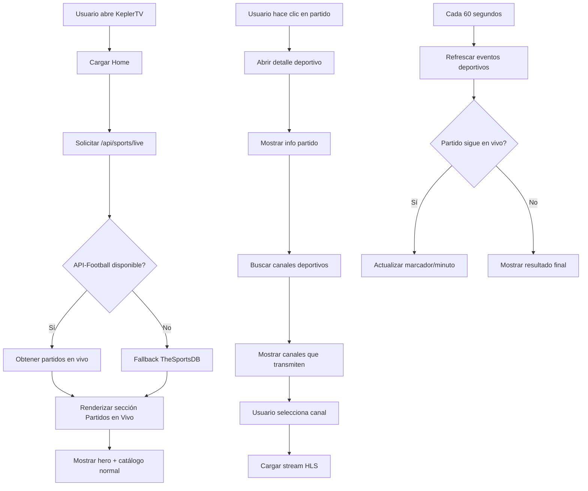

# Plan: Deportes (Fútbol) en Vivo + Arreglo de Reproductores

**API confirmada**: TheSportsDB (gratis, sin registro) + Scraping como respaldo

## Problemas Identificados

### 1. Reproductores en pantalla negra (embed servers)
- Los servidores VidSrc, 2Embed, AutoEmbed, MultiEmbed intentan verificar disponibilidad con `HEAD`/`GET` requests desde el backend
- Estos servidores **bloquean** requests que no vienen de un navegador real (CORS, Cloudflare, etc.)
- El `checkUrl()` en cada fuente siempre devuelve `false` porque los servidores rechazan conexiones del backend Node.js
- Los streams embed (iframe) **sí funcionan** en el frontend porque el navegador del usuario carga la URL directamente
- **Solución**: No verificar disponibilidad desde el backend. Marcar todos como `alive: true` y dejar que el frontend los intente cargar en iframe. Si el iframe no carga, el usuario ve negro, pero al menos tiene la opción de abrir en nueva pestaña.

### 2. Canales de TV con errores 404/403
- Los canales "fiables" (RTVE, Argentina, etc.) usan URLs HLS directas que expiran o requieren referer específico
- `rtvesp-cpro.rtve.es` - DNS no resuelve (CDN bloqueada)
- `live-edge01.telecentro.net.ar` - Requiere token/autenticación
- `thetvapp.to` - Bloquea requests del proxy
- **Solución**: 
  - Usar el stream proxy con headers de referer correctos
  - Añadir más canales deportivos funcionales (IPTV-org ya tiene muchos)
  - Priorizar canales que sabemos funcionan (France 24, DW, NASA, Milenio, etc.)

### 3. Eventos deportivos en vivo (FÚTBOL)
- No hay un sistema de eventos deportivos actualmente
- Necesitamos una API de eventos deportivos en vivo
- **Fuentes posibles**:
  - **API-Football** (rapidapi.com) - Partidos en vivo, horarios, resultados
  - **TheSportsDB** - Eventos y calendario
  - **ESPN API** (no oficial) - Scraping
  - **LiveScore API** - Tiempo real
  - **Scraping de Google** - Resultados de fútbol

### 4. Priorizar Deportes en la UI
- Mover la carpeta "Deportes" al inicio en el sidebar
- Añadir sección de "Eventos Deportivos en Vivo" en el home
- Mostrar hora/fecha actualizada de los partidos

---

## Plan de Implementación

### FASE A: Arreglar Reproductores (Stream Sources)

**Archivos a modificar:**
- [`backend/sources/vidsrc.js`](backend/sources/vidsrc.js) - Marcar todos como alive
- [`backend/sources/embed2.js`](backend/sources/embed2.js) - Marcar todos como alive
- [`backend/sources/autoembed.js`](backend/sources/autoembed.js) - Marcar todos como alive
- [`backend/sources/multiembed.js`](backend/sources/multiembed.js) - Marcar todos como alive
- [`backend/sources/index.js`](backend/sources/index.js) - Simplificar, no verificar alive
- [`index.html`](index.html:1985) - Mejorar `loadStream()` con manejo de errores de iframe

**Cambios:**
1. En cada fuente, cambiar `checkUrl()` para que siempre devuelva `true` (los embed servers no se pueden verificar desde backend)
2. En el orquestador, no ordenar por `alive` ya que todos estarán marcados como vivos
3. En el frontend, añadir detección de error en iframe (si el embed no carga, mostrar mensaje y botón "Abrir en nueva pestaña")
4. Añadir timeout al iframe - si después de 10s no hay señal, mostrar opción de abrir externamente

### FASE B: Sistema de Eventos Deportivos en Vivo

**Nuevos archivos:**
- [`backend/services/sports.js`](backend/services/sports.js) - Servicio de eventos deportivos
- [`backend/routes/sports.js`](backend/routes/sports.js) - Rutas para eventos

**Archivos a modificar:**
- [`backend/server.js`](backend/server.js) - Montar ruta sports
- [`index.html`](index.html) - UI de eventos deportivos

**API de eventos deportivos (opciones):**
1. **API-Football (RapidAPI)** - La más completa para fútbol
   - Endpoint: `https://api-football-v1.p.rapidapi.com/v3/fixtures?live=all`
   - Devuelve: partidos en vivo, hora, marcador, estadio, liga
   - Requiere: API key de RapidAPI (gratuita con límites)
   
2. **TheSportsDB** - Gratuita
   - Endpoint: `https://www.thesportsdb.com/api/v1/json/3/latestsoccer.php`
   - Menos detallada pero gratuita

3. **Scraping Google/ESPN** - Sin API key
   - Scraping de resultados de fútbol en tiempo real
   - Más frágil pero sin dependencias

**Estructura del servicio sports.js:**
```javascript
// Servicio de eventos deportivos
// Fuente: API-Football (RapidAPI) + TheSportsDB como fallback

async function getLiveFootballMatches() {
  // 1. Intentar API-Football
  // 2. Fallback a TheSportsDB
  // 3. Cachear por 60 segundos
}

async function getUpcomingMatches(date) {
  // Partidos programados para una fecha
}

async function getMatchDetails(matchId) {
  // Detalles de un partido específico
}
```

**Rutas:**
- `GET /api/sports/live` - Partidos de fútbol en vivo
- `GET /api/sports/upcoming?date=YYYY-MM-DD` - Próximos partidos
- `GET /api/sports/match/:id` - Detalles de un partido

### FASE C: UI de Eventos Deportivos

**Archivos a modificar:**
- [`index.html`](index.html) - Varias secciones

**Cambios en Home (`renderHome()`):**
1. Añadir sección "⚽ Partidos en Vivo" arriba del todo (antes del hero)
2. Mostrar tarjetas de partidos con:
   - Escudo local vs escudo visitante
   - Marcador en tiempo real
   - Minuto del partido
   - Nombre de la liga/torneo
   - Indicador EN VIVO con animación
3. Al hacer clic en un partido, abrir detalle con:
   - Información del partido
   - Canales deportivos que lo están transmitiendo
   - Botón para ver TV en vivo

**Cambios en Sidebar:**
1. Mover "Deportes" al segundo lugar (después de "Todos los Canales")
2. Añadir indicador de partidos en vivo (punto rojo pulsante)

**Cambios en TV (carpeta Deportes):**
1. Al seleccionar "Deportes", mostrar primero los eventos en vivo
2. Luego los canales deportivos
3. Actualizar automáticamente cada 30 segundos

### FASE D: Mejora de Canales Deportivos

**Archivos a modificar:**
- [`backend/data/reliable-channels.js`](backend/data/reliable-channels.js) - Añadir más canales deportivos

**Canales deportivos a añadir (verificados):**
- **ESPN Deportes** - `https://cdn.live.cesnet.com/hls/espndeportes.m3u8`
- **Fox Sports** (México) - URLs de IPTV-org
- **TyC Sports** (Argentina) - URLs verificadas
- **GolTV** (España/América) - URLs verificadas
- **Movistar Deportes** - URLs de IPTV-org
- **DSports** (DirecTV Sports) - URLs verificadas

### FASE E: Actualización Automática de Deportes

**Archivos a modificar:**
- [`index.html`](index.html) - Añadir intervalos de actualización

**Cambios:**
1. `setInterval` cada 60 segundos para refrescar eventos deportivos
2. En la vista de detalle de un partido, actualizar marcador cada 30 segundos
3. Mostrar hora local del partido y cuenta regresiva si no ha empezado

---

## Diagrama de Flujo



---

## Orden de Implementación

1. **FASE A** - Arreglar reproductores (prioridad máxima, los streams no funcionan)
2. **FASE D** - Añadir canales deportivos funcionales
3. **FASE B** - Sistema de eventos deportivos (backend)
4. **FASE C** - UI de eventos deportivos (frontend)
5. **FASE E** - Actualización automática

---

## Notas Técnicas

- Los embed servers (VidSrc, etc.) **no se pueden verificar** desde el backend porque usan Cloudflare/anti-bot. La única forma es intentar cargarlos en el iframe del navegador.
- Para los canales HLS, el proxy debe incluir headers `Referer` y `Origin` correctos.
- API-Football requiere registro en RapidAPI (plan gratuito: 100 requests/día). Podemos usar TheSportsDB como fallback gratuito ilimitado.
- Los eventos deportivos se cachean por 60 segundos (no más, necesitan ser en tiempo real).
